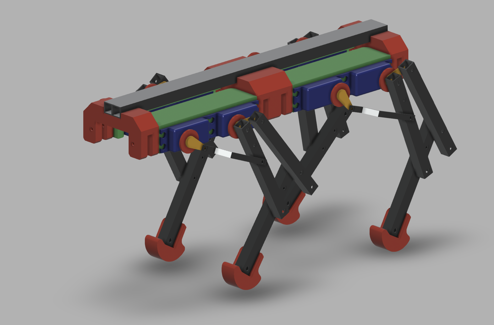

# FLR „Aron”

# Mk2 is on the way
Currently a new version is in the developement, hence all the code and data for the mk1 were moved ot the mk1 folder. 

The info about the mk2 will be updated here soon.
For the moment please take a look at the vide playlist:
[YouTube Playlist](https://www.youtube.com/watch?v=CJRxDc_nvHY&list=PL9g9iwA2sCQyebAMLQ3WOS7w4_cqAUxdq)

#
#

# Original info about Aron Mk1
## Intro
FLR as Four Leg Robot - is a hobby project aimed for experimenting with the idea of simple and affordable four leg robot build. It’s a playground for self study of the basic ideas of kinetic, stability and more.

## More info
There is a set of videos - mostly in polish abut Aron and other robotic projects of mine. 

## Hardware
Hardware is based on the generally available parts and some simple 3D prints. The 3D model made in Autodesk Fusion 360 is available to download in the „Mechanical_Model” folder of this directory.

[fourleg/Mechanical_Model at main · tymancjo/fourleg · GitHub](https://github.com/tymancjo/fourleg/tree/main/Mechanical_Model)

And a 3d visualization under the link:
https://gmail1957699.autodesk360.com/g/shares/SH35dfcQT936092f0e43c23261b81addf43c

Beside the mechanicals the main components are MG995 180 degree servos (or in general any servo of the similar size and torque) , the PCA9685 16-Channel 12-bit PWM/Servo Driver to drive them and and esp32 as a main controller of the system. But the main controller role can be covered as well by Arduino board of generally any kind. 

Power source is made of the 2S2P set of 18650 Li-Ion cells with appropriate BMS system followed by 2 independent DC/DC converters that are stabilizing the voltage at 5V for servos (the V+ power on the PCA9685) and another 5V for the esp32. 

In the prototype unit additionally an esp32cam is installed enabling some experiments possibility with simple computer vision. However it’s not a crucial element of the system. 

## Software
The software is created in the Arduino IDE environment and utilize the supporting libraries from Adafruit and other ESP32 related ones. 
The main firmware file is the „esp32_servo_from_uart_WiFi” sketch located in the Arduino folder. 

[fourleg/Arduino at main · tymancjo/fourleg · GitHub](https://github.com/tymancjo/fourleg/tree/main/Arduino)

Separate software is available for the esp32cam module - and it is based on the available esp32cam example sketch delivered with the word manager resources. 

Additionally some python helper programs are available - mostly used for plying around with preparing Aron poses and move sequences. 

## Usage
There are two main ways to control the Aron behavior. 
Firstly by the webpage.

### Webpage interface
When powered up the esp32 main unit setup a WiFi access point by a name BB.LAB.ARON and pass 123456789 (yeap! the super secure one). When connected to this network - an webpage is available under 192.168.1.1 IP address from where the pre-programmed behavior can be controlled by use of buttons. 
It’s extreakly simple interface and shall be quite self explanatory. 

### Serial (UART)
The other way of control is via the UART (serial port) communication to the main esp32. The transmission is set up tu go with the 115200 baud rate. But all of this can be modified in the firmware. 

The way to send orders is to use the following string scheme:
> <C,s1,s2,s3,s4,s5,s6,s7,s8>   

Where: 
C - is the command id
And the s1 to s8 are parameters. 

The main commands are:
42 - makes the servos set up to the given angles where s1 to s8 are servo angles. 

44 - recall one of the stored positions, where s1 is the number of position (counting from 0), s2 to s8 need to be set to some value (any). 

46 - plays saved sequence, where s1 is the sequence number, and the s2 is number of repetition (1 to 20). S3 to s8 need to be set to any number.

55 - saves the servos as new stored position taking  the given angles where s1 to s8 are servo angles. 

#### Servos numbering
